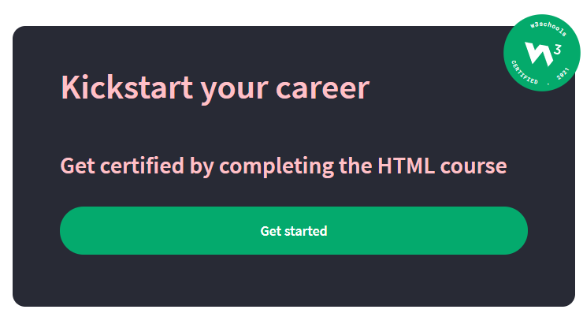

# Challenge Folder

---

This folder contains some challenges to be solved with **HTML** and **CSS**

  
<b>W3schools get certificate card</b>

  
You need to build a responsive card like those cards: 

  

    
    
    
  

